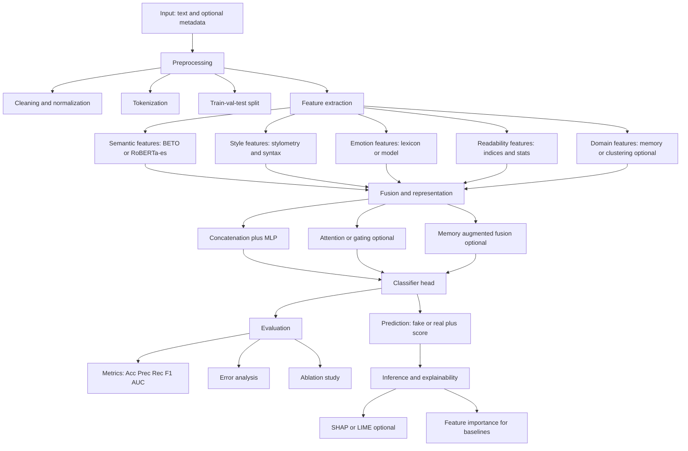

# Architecture — FakeNewsStyle

## 1) Objetivo

Este proyecto implementa una arquitectura modular para **detección de noticias falsas en español**, integrando múltiples familias de características:

- **Semánticas** (embeddings tipo BERT/RoBERTa-es/BETO)
- **Estilo** (rasgos lingüísticos/estilométricos, n-grams, POS patterns, puntuación, etc.)
- **Emoción/Sentimiento** (lexicons o modelos)
- **Legibilidad** (readability, complejidad, longitud, etc.)
- **Dominio** (memoria por dominio/tema/fuente si aplica)

La arquitectura está diseñada para ser **reproducible y extensible**.

---

## 2) Diagrama lógico (alto nivel)

# Arquitectura
