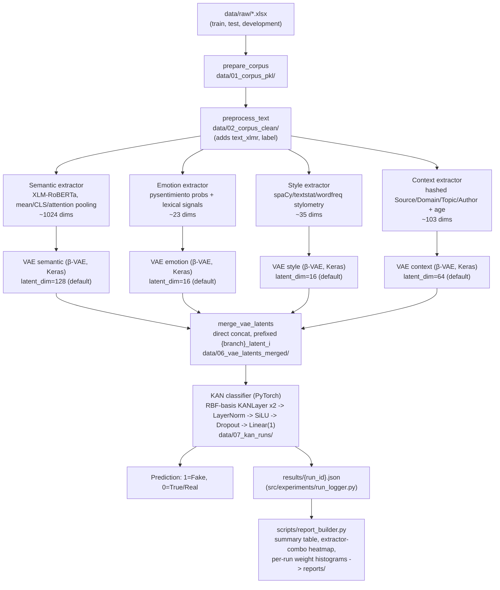

# Architecture — FakeNewsStyle

## 1) Objective

This project implements a modular, reproducible, and extensible architecture for **fake news detection in Spanish**.

### Research motivation

Most fake news detection approaches rely primarily on **semantic representations** derived from large pretrained language models. However, deceptive content often exhibits **distinctive writing styles, emotional patterns, and structural/contextual cues** that are complementary to semantics alone. This project explores:

- The contribution of **stylistic features** (readability, formality, syntax, lexical diversity) to fake news detection, beyond what a semantic embedding alone captures.
- The effectiveness of **multi-feature modular architectures**, where each signal family is extracted and modeled independently rather than folded into a single end-to-end model.
- The role of **emotional and contextual signals** — affective language and publication metadata — as detection features in their own right, not just as auxiliary inputs.
- The interaction between semantic and non-semantic representations when fused for classification.
- The use of **latent compression (VAE)** to bring heterogeneous, unevenly-sized feature spaces (e.g. a ~1024-dim semantic embedding vs. a ~35-dim style vector) down to a comparable, denoised scale before fusion.

### Feature families

Four independent feature families are extracted per article:

- **Semantic** — XLM-RoBERTa embeddings capturing the deep contextual meaning of the text: what the article is actually saying. This is the signal most existing fake-news detectors rely on almost exclusively, so it serves here as the baseline representation the other three families complement.
- **Emotion/Sentiment** — `pysentimiento` emotion and sentiment probabilities plus 13 handcrafted lexical signals (exclamation/question density, uppercase ratio, emoji use, sensational-intensifier words, repeated punctuation, etc.). Captures the affective and sensational load of the writing — outrage, fear, or clickbait framing — independent of what the text is actually reporting.
- **Style** — stylometry via spaCy/textstat/wordfreq: readability, formality, syntactic complexity, lexical diversity, POS distribution, an OOV/typo-rate proxy, and 17 extra signals (hedging language, passive/impersonal constructions, sentence-length burstiness, etc.). Captures *how* something is written, independent of topic or sentiment — a known correlate of journalistic quality vs. hastily-produced disinformation.
- **Context** — deterministic hash embeddings (no model, no training required) of source, domain, topic, and author, plus a normalized article-age feature and binary flags for whether each field was even populated. Captures *where*, *when*, and *by whom* a piece was published — publication metadata that is independent of the article's text, where even missing metadata (no byline, no date) is itself a signal.

Each family is compressed independently by its own VAE, and the resulting latent spaces are concatenated directly (no shared projection stage) before entering the classifier. The whole pipeline is driven by `main.py` flags — see `CLAUDE.md` for the exact execution sequence. Section 3 below documents the exact business rules (formulas, thresholds, output schemas) behind each family.

> **Note**: `docs/architecture_overview.svg` is a diagram inherited from an earlier version of the project. It contains no extractable text (it's a vectorized export with zero `<text>` elements) and its accuracy could not be verified, so it is no longer referenced here as authoritative. The diagram below reflects the pipeline as actually implemented in `main.py` as of this revision.

---

## 2) Pipeline diagram

```mermaid
flowchart TD
  A["data/raw/*.xlsx\n(train, test, development)"] --> B["prepare_corpus\ndata/01_corpus_pkl/"]
  B --> C["preprocess_text\ndata/02_corpus_clean/\n(adds text_xlmr, label)"]

  C --> D1["Semantic extractor\nXLM-RoBERTa, mean/CLS/attention pooling\n~1024 dims"]
  C --> D2["Emotion extractor\npysentimiento probs + lexical signals\n~23 dims"]
  C --> D3["Style extractor\nspaCy/textstat/wordfreq stylometry\n~35 dims"]
  C --> D4["Context extractor\nhashed Source/Domain/Topic/Author + age\n~103 dims"]

  D1 --> E1["VAE semantic (β-VAE, Keras)\nlatent_dim=128 (default)"]
  D2 --> E2["VAE emotion (β-VAE, Keras)\nlatent_dim=16 (default)"]
  D3 --> E3["VAE style (β-VAE, Keras)\nlatent_dim=16 (default)"]
  D4 --> E4["VAE context (β-VAE, Keras)\nlatent_dim=64 (default)"]

  E1 --> F["merge_vae_latents\ndirect concat, prefixed {branch}_latent_i\ndata/06_vae_latents_merged/"]
  E2 --> F
  E3 --> F
  E4 --> F

  F --> G["KAN classifier (PyTorch)\nRBF-basis KANLayer x2 -> LayerNorm -> SiLU -> Dropout -> Linear(1)\ndata/07_kan_runs/"]
  G --> H["Prediction: 1=Fake, 0=True/Real"]
  G --> I["results/{run_id}.json\n(src/experiments/run_logger.py)"]
  I --> J["scripts/report_builder.py\nsummary table, extractor-combo heatmap,\nper-run weight histograms -> reports/"]
```

Any branch can be fully excluded from VAE training and from the KAN input with `--exclude_semantic` / `--exclude_emotion` / `--exclude_style` / `--exclude_context`, without needing to re-extract its raw features.

---

## 3) Feature extractors — business rules

Each extractor answers a different question about the article. This section documents exactly what each one measures, not just which library it calls — see the corresponding file under `src/features/` for the implementation.

### 3.1 Semantic extractor (`src/features/semantic_extractor.py`)

**What it captures**: the deep contextual meaning of the text, via a pretrained language model — the signal most existing fake-news detectors rely on almost exclusively.

- **Model**: `FacebookAI/xlm-roberta-large-finetuned-conll02-spanish` (HF `AutoModel`), input is `text_xlmr` (produced upstream by preprocessing), truncated/padded to `max_len=256` tokens.
- **Pooling strategy** (one document vector, dim = model hidden size, e.g. 1024) — configurable via `--semantic_pooling`:
  - `mean` (default): average of token embeddings over non-padding positions.
  - `cls`: the `<s>` token embedding only.
  - `attention`: a learned self-attentive pooling (`scores = v(tanh(proj(h)))`, softmax over non-padded tokens). **Untrained/random-init unless the whole model is fine-tuned end-to-end** — do not treat its output as meaningful otherwise.
- **L2 normalization** applied to the final embedding by default (not exposed as a CLI flag — `main.py` always uses the extractor's default of `l2_normalize=True`).
- **Output** (DataFrame, `sem_emb` list column): `Id`, `label`, `sem_emb`, plus per-file metadata (`pooling`, `model_name`, `max_len`, `l2_normalize`).

### 3.2 Emotion extractor (`src/features/emotion_extractor.py`)

**What it captures**: the emotional/affective load of the writing — fake news frequently leans on outrage, fear, or sensationalism to drive engagement, independent of what it's actually saying.

- **Model outputs**: two `pysentimiento` Spanish classifiers run per document — `emotion` (multi-class emotion probabilities, e.g. joy/anger/fear/sadness/etc.) and `sentiment` (positive/negative/neutral probabilities). Labels are sorted alphabetically and stored per-file (`emo_labels`, `sent_labels`).
- **Handcrafted "emotional style" signals** (13 total, ratio-normalized by character count — `main.py` hardcodes `normalize_signals_by="chars"`; the underlying function also supports token-count normalization, just not exposed as a CLI flag):

  | Signal | What it measures |
  |---|---|
  | `sig_exclam_ratio` | `!` density — exclamatory/alarmist tone |
  | `sig_question_ratio` | `?` density — rhetorical/clickbait framing |
  | `sig_uppercase_ratio` | fraction of letters in uppercase — SHOUTING emphasis |
  | `sig_emoji_ratio` | emoji count per word — informal/emotional register |
  | `sig_intensifier_ratio` | fraction of words drawn from a 20-word Spanish sensational-intensifier list (e.g. "increíble", "urgente") |
  | `sig_len_chars` / `sig_len_tokens` | raw document length |
  | `sig_punct_ratio` | non-alphanumeric character density |
  | `sig_digit_ratio` | digit density |
  | `sig_repeat_exclam_ratio` / `sig_repeat_question_ratio` | density of `!!`/`??` runs — exaggerated punctuation |
  | `sig_elipsis_ratio` | density of `...` — suspense/incompleteness framing |
  | `sig_quote_ratio` | quotation-mark density |

- **Output** (DataFrame): `Id`, `label`, `emo_probs`, `sent_probs`, `signals` (list columns aligned to their respective label/name lists), plus per-file metadata.

### 3.3 Style extractor (`src/features/style_extractor.py`)

**What it captures**: *how* something is written, independent of topic or sentiment — readability, formality, syntactic sophistication, and lexical richness are known correlates of journalistic quality vs. hastily-produced disinformation.

- **Libraries**: spaCy (`es_core_news_sm` by default) for POS/dependency parsing, `textstat` for readability counts, `wordfreq` for word-rarity lookup. All three are optional — if unavailable, the extractor degrades gracefully to a regex-only fallback (POS/dependency/formality features return `0.0`, everything else still computed).
- **Readability**: `ifsz` — Spanish Flesch–Szigriszt index, `206.835 - 62.3*(syllables/words) - (words/sentences)`. Higher = easier to read.
- **Formality**: `formality_f` — Heylighen & Dewaele F-score, `(formal_POS_count - informal_POS_count) / total_POS_count * 100`, where formal = noun/proper-noun/adjective/adposition/determiner and informal = pronoun/verb/auxiliary/adverb/interjection. Higher = more formal register.
- **Syntactic complexity**: `len_sent` (mean tokens per sentence), `sconj_per_sent` (subordinating-conjunction density — nested/complex clauses), `avg_dep_depth` (mean dependency-tree depth), `verbs_per_sent`.
- **Lexical diversity**: `ttr` (type-token ratio), `redundancy` (`1 - ttr`), `herdans_c` (Herdan's C, `log(V)/log(N)`), `root_ttr` (Guiraud's root TTR, `V/sqrt(N)`) — length-robust alternatives to raw TTR.
- **POS distribution**: `pos_noun_ratio`, `pos_verb_ratio`, `pos_adj_ratio`, `pos_adv_ratio`, `pos_pron_ratio`, `pos_det_ratio`, `pos_adp_ratio` — each POS tag's share of all tagged tokens.
- **Spelling/OOV quality**: `error_rate` — fraction of words whose `wordfreq.zipf_frequency` falls below `--style_oov_zipf_threshold` (default **1.5**), used as an approximate typo/rare-word/OOV proxy.
- **Extra stylometric signals** (17, on by default — pass `--style_no_extra_signals` to disable): punctuation/uppercase/digit/percent density, repeated-character runs (`sig_repeated_char_ratio`, catches things like "increíbleeee"), average/long-word ratios, stopword ratio, sensational-intensifier ratio, `sig_se_per_sent` (density of the Spanish reflexive/impersonal "se" — passive-voice proxy), **`sig_hedge_ratio`** (fraction of words from an epistemic-hedging set — `podría`, `posiblemente`, `presuntamente`, `según`, `dicen`, etc. — directly relevant to unverified "alleged" claim framing typical of fake news), `sig_proper_like_ratio` (proper-noun density), `sig_burstiness` (standard deviation of sentence length — rhythm irregularity).
- **Normalization**: ratio features clipped to `[0,1]`; `formality_f`/`ifsz` squashed via `tanh(x/100)`; count-like features via `log1p`.
- **Output**: a **dict payload** (`{X, feature_names, num_samples, feature_dim, meta, ids}`), not a DataFrame — different schema from semantic/emotion.

### 3.4 Context extractor (`src/features/context_extractor.py`)

**What it captures**: publication metadata — *where* and *when* a piece was published, and by whom — as a signal independent of the article's text. No model, no training: purely deterministic feature hashing (MD5-based), so it works out of the box on any corpus with the relevant columns.

- **Hash embeddings** (signed feature hashing, `n_hashes=2` independent hash draws combined per value to reduce collision bias), one fixed-size vector per categorical field:
  - `ctx_source_emb_*` (32 dims default) — the outlet/source name.
  - `ctx_domain_emb_*` (32 dims default) — the domain parsed from the article's `Link` (`www.` stripped, lowercased).
  - `ctx_topic_emb_*` (16 dims default) — the `Topic` field.
  - `ctx_author_emb_*` (16 dims default) — the byline, taken from an explicit author column if configured, otherwise heuristically parsed from the URL path (`/author/<name>/`, `/autor/<name>/`) or query string.
- **`ctx_age_days`** — article age relative to a reference datetime (defaults to "now" UTC), capped to ±10 years (3650 days) and normalized to roughly `[-1, 1]`. Supports Unix timestamps, ISO 8601, and several `dd/mm/yyyy`-style formats; falls back to `-1.0` if no date is configured or parsing fails.
- **Presence flags** (`ctx_has_link`, `ctx_has_domain`, `ctx_has_source`, `ctx_has_topic`, `ctx_has_author`, `ctx_has_date`) — binary indicators of whether each field was actually populated, since missing metadata is itself informative (e.g. fake news sites more often omit bylines or dates).
- **Output**: a dict payload, same shape as the style extractor's (`X` is `source_dim+domain_dim+topic_dim+author_dim+1+6` = 103 dims by default), with `feature_names` in a fixed, documented order.

---

## 4) Implementation notes

- **KAN is not a literal spline network**: `KANLayer` uses a fixed RBF basis (`linspace(-3, 3, num_basis)` with a shared learnable width), not Kolmogorov-Arnold splines. See `src/models/kan.py`.
- **There is no shared projection stage** (`z_sem → 16`, etc.) — each VAE's latent vector is concatenated at its own dimensionality. With current defaults that's 128+16+16+64 = 224 input dims to the KAN.
- **Two raw-feature merge paths exist** — `src/features/feature_merger.py` is **not wired into `main.py`** (dead code, don't confuse it with the live one); the pipeline actually uses `src/features/merge_raw_features_for_kan.py`.
- Components mentioned in earlier versions of this document (attention/gating fusion, memory-augmented fusion, SHAP/LIME explainability, a separate domain-memory module) are **not implemented** — don't assume they exist without checking the code first.
